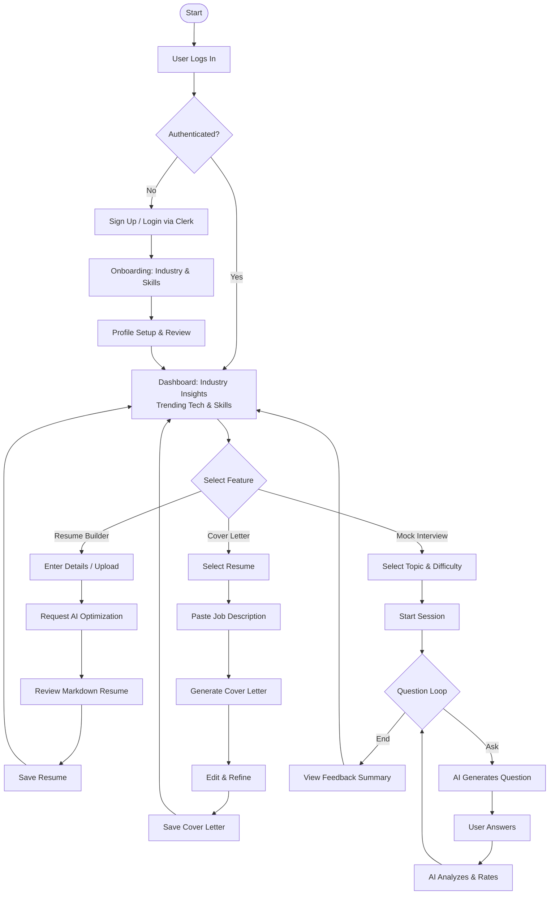
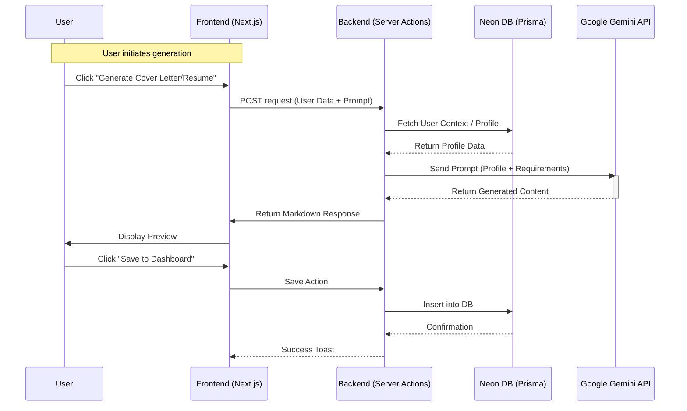
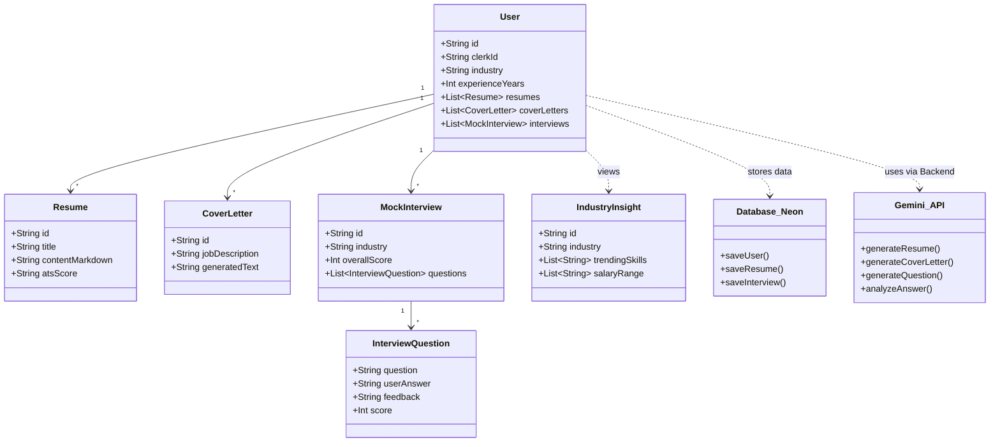
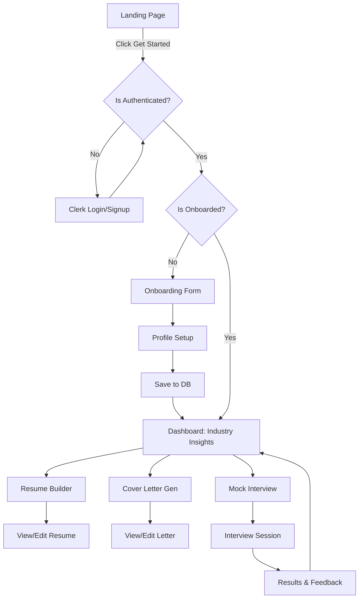
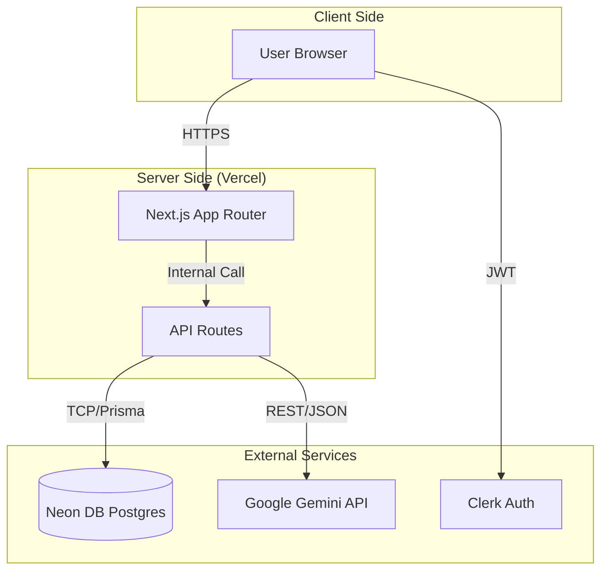

# UML Diagrams for AI Career Coach

> **Note**: For the best viewing experience, please open `UML_Visualization.html` in your browser.

## 1. Use Case Diagram
Describes the functional requirements and user interactions with the system.

```mermaid
usecaseDiagram
    actor "Job Seeker" as User
    actor "Google Gemini API" as AI
    actor "Clerk Auth" as Auth

    usecase "Sign Up / Sign In" as UC1
    usecase "Onboarding (Industry/Experience)" as UC2
    usecase "Dashboard: Industry Insights" as UC6
    usecase "Create AI Resume" as UC3
    usecase "Generate Cover Letter" as UC4
    usecase "Start Mock Interview" as UC5
    usecase "Download Documents" as UC7

    User --> UC1
    User --> UC2
    User --> UC6
    User --> UC3
    User --> UC4
    User --> UC5
    User --> UC7

    UC1 ..> Auth : uses
    UC3 ..> AI : generates content
    UC4 ..> AI : generates content
    UC5 ..> AI : generates Q&A
```

## 2. Activity Diagram
Comprehensive system flow including Resume Builder, Cover Letter, and Interviews.



## 3. Sequence Diagram
Showing the interaction sequence for generating content (Resume/Letter).



## 4. Class Diagram
Represents the database schema and object relationships, including external services.



## 5. Flowchart Diagram (System Flow)
High-level navigation flow of the application.



## 6. Deployment Diagram
Shows the physical/architectural deployment of the system.


