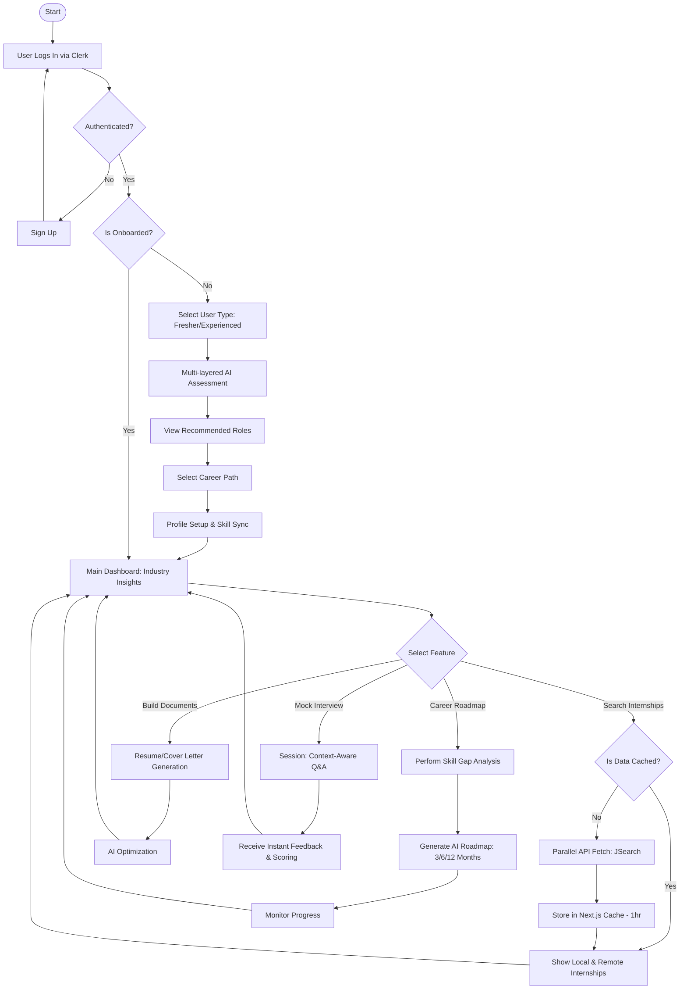
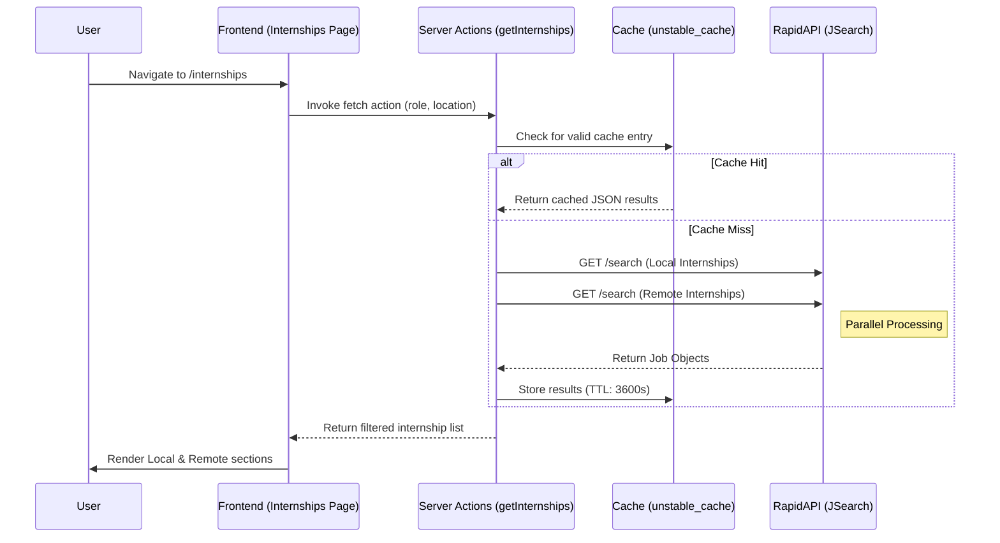
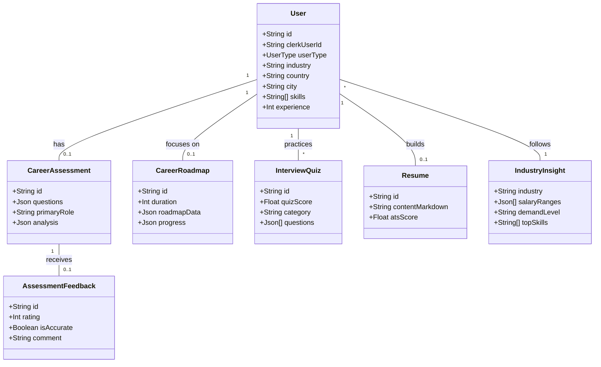
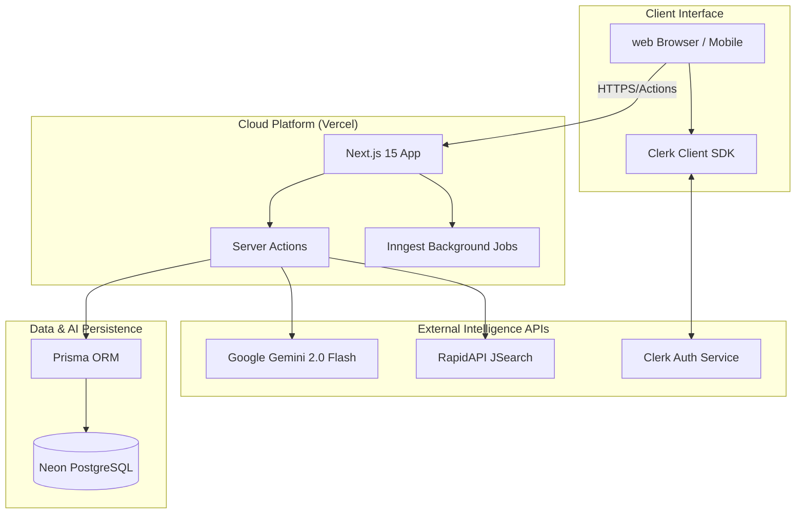

# UML Diagrams for AI Career Pilot

> **Note**: These diagrams represent the latest architectural features of the AI Career Pilot platform, including multi-layered assessments, location-based internship search, and AI-driven career roadmaps.

## 1. Use Case Diagram
Describes the functional requirements and user interactions with the system, highlighting the AI-powered features.

```mermaid
usecaseDiagram
    actor "User (Job Seeker)" as User
    actor "Google Gemini API" as AI
    actor "Clerk Auth" as Auth
    actor "JSearch API" as Jobs

    usecase "Sign Up / Sign In" as UC1
    usecase "Perform Multi-layered Assessment" as UC2
    usecase "Select Career Path" as UC3
    usecase "View Industry Insights" as UC4
    usecase "Build AI-Optimized Resume" as UC5
    usecase "Generate Tailored Cover Letter" as UC6
    usecase "Practice Mock Interview" as UC7
    usecase "Search Internships (Local/Remote)" as UC8
    usecase "Generate Career Roadmap" as UC9
    usecase "Provide Assessment Feedback" as UC10

    User --> UC1
    User --> UC2
    User --> UC3
    User --> UC4
    User --> UC5
    User --> UC6
    User --> UC7
    User --> UC8
    User --> UC9
    User --> UC10

    UC1 ..> Auth : verifies
    UC2 ..> AI : analyzes responses
    UC5 ..> AI : optimizes content
    UC6 ..> AI : generates text
    UC7 ..> AI : provides feedback
    UC8 ..> Jobs : fetches data
    UC9 ..> AI : generates learning path
```

## 2. Activity Diagram
Comprehensive system flow showing the progression from onboarding to career-ready artifacts.

```mermaid
flowchart TD
    start([Start]) --> Login[User Logs In via Clerk]
    Login --> Auth{Authenticated?}
    Auth -- No --> Signup[Sign Up]
    Signup --> Login
    Auth -- Yes --> CheckOnboard{Is Onboarded?}
    
    CheckOnboard -- No --> SelectType[Select User Type: Fresher/Experienced]
    SelectType --> QualAssess[Multi-layered AI Assessment]
    QualAssess --> Results[View Recommended Roles]
    Results --> PathSel[Select Career Path]
    PathSel --> ProfileSetup[Profile Setup & Skill Sync]
    ProfileSetup --> Dashboard
    
    CheckOnboard -- Yes --> Dashboard[Main Dashboard: Industry Insights]
    
    Dashboard --> Features{Select Feature}
    
    %% Internship Path
    Features -- Search Internships --> CacheCheck{Is Data Cached?}
    CacheCheck -- Yes --> ShowJobs[Show Local & Remote Internships]
    CacheCheck -- No --> APIFetch[Parallel API Fetch: JSearch]
    APIFetch --> StoreCache[Store in Next.js Cache - 1hr]
    StoreCache --> ShowJobs
    
    %% Roadmap Path
    Features -- Career Roadmap --> GapAnalysis[Perform Skill Gap Analysis]
    GapAnalysis --> GenRoadmap[Generate AI Roadmap: 3/6/12 Months]
     GenRoadmap --> MarkProgress[Monitor Progress]
    
    %% Resume/CL Path
    Features -- Build Documents --> DocGen[Resume/Cover Letter Generation]
    DocGen --> AIEdit[AI Optimization]
    
    %% Interview Path
    Features -- Mock Interview --> IntSess[Session: Context-Aware Q&A]
    IntSess --> AIFeedback[Receive Instant Feedback & Scoring]
    
    ShowJobs --> Dashboard
    MarkProgress --> Dashboard
    AIEdit --> Dashboard
    AIFeedback --> Dashboard
```

## 3. Sequence Diagram: Internship Search with Caching
Showing how the system optimizes API calls using the caching strategy described in the project documentation.

```mermaid
sequenceDiagram
    participant U as User
    participant FE as Frontend (Internships Page)
    participant BE as Server Actions (getInternships)
    participant CA as Cache (unstable_cache)
    participant RA as RapidAPI (JSearch)

    U->>FE: Navigate to /internships
    FE->>BE: Invoke fetch action (role, location)
    BE->>CA: Check for valid cache entry
    
    alt Cache Hit
        CA-->>BE: Return cached JSON results
    else Cache Miss
        BE->>RA: GET /search (Local Internships)
        BE->>RA: GET /search (Remote Internships)
        Note right of RA: Parallel Processing
        RA-->>BE: Return Job Objects
        BE->>CA: Store results (TTL: 3600s)
    end
    
    BE-->>FE: Return filtered internship list
    FE->>U: Render Local & Remote sections
```

## 4. Class Diagram (Database Schema)
Represents the Prisma models and their inter-relationships within the Neon PostgreSQL database.

```mermaid
classDiagram
    class User {
        +String id
        +String clerkUserId
        +UserType userType
        +String industry
        +String country
        +String city
        +String[] skills
        +Int experience
    }
    
    class CareerAssessment {
        +String id
        +Json questions
        +String primaryRole
        +Json analysis
    }
    
    class CareerRoadmap {
        +String id
        +Int duration
        +Json roadmapData
        +Json progress
    }
    
    class InterviewQuiz {
        +String id
        +Float quizScore
        +String category
        +Json[] questions
    }
    
    class Resume {
        +String id
        +String contentMarkdown
        +Float atsScore
    }
    
    class AssessmentFeedback {
        +String id
        +Int rating
        +Boolean isAccurate
        +String comment
    }

    class IndustryInsight {
        +String industry
        +Json[] salaryRanges
        +String demandLevel
        +String[] topSkills
    }
    
    User "1" -- "0..1" CareerAssessment : has
    User "1" -- "0..1" CareerRoadmap : focuses on
    User "1" -- "0..1" Resume : builds
    User "1" -- "*" InterviewQuiz : practices
    CareerAssessment "1" -- "0..1" AssessmentFeedback : receives
    User "*" -- "1" IndustryInsight : follows
```

## 5. Deployment Diagram
Visualizing the modern serverless infrastructure used by AI Career Pilot.

```mermaid
graph TB
    subgraph Client ["Client Interface"]
        Web[web Browser / Mobile]
        AuthC[Clerk Client SDK]
    end
    
    subgraph Vercel ["Cloud Platform (Vercel)"]
        NextJS[Next.js 15 App]
        Actions[Server Actions]
        Jobs[Inngest Background Jobs]
    end
    
    subgraph Data ["Data & AI Persistence"]
        Neon[(Neon PostgreSQL)]
        Prisma[Prisma ORM]
    end
    
    subgraph External ["External Intelligence APIs"]
        Gemini[Google Gemini 2.0 Flash]
        Rapid[RapidAPI JSearch]
        Clerk[Clerk Auth Service]
    end

    Web -->|HTTPS/Actions| NextJS
    NextJS --> Actions
    Actions --> Prisma
    Prisma --> Neon
    Actions --> Gemini
    Actions --> Rapid
    NextJS --> Jobs
    Web --> AuthC
    AuthC <--> Clerk
```
